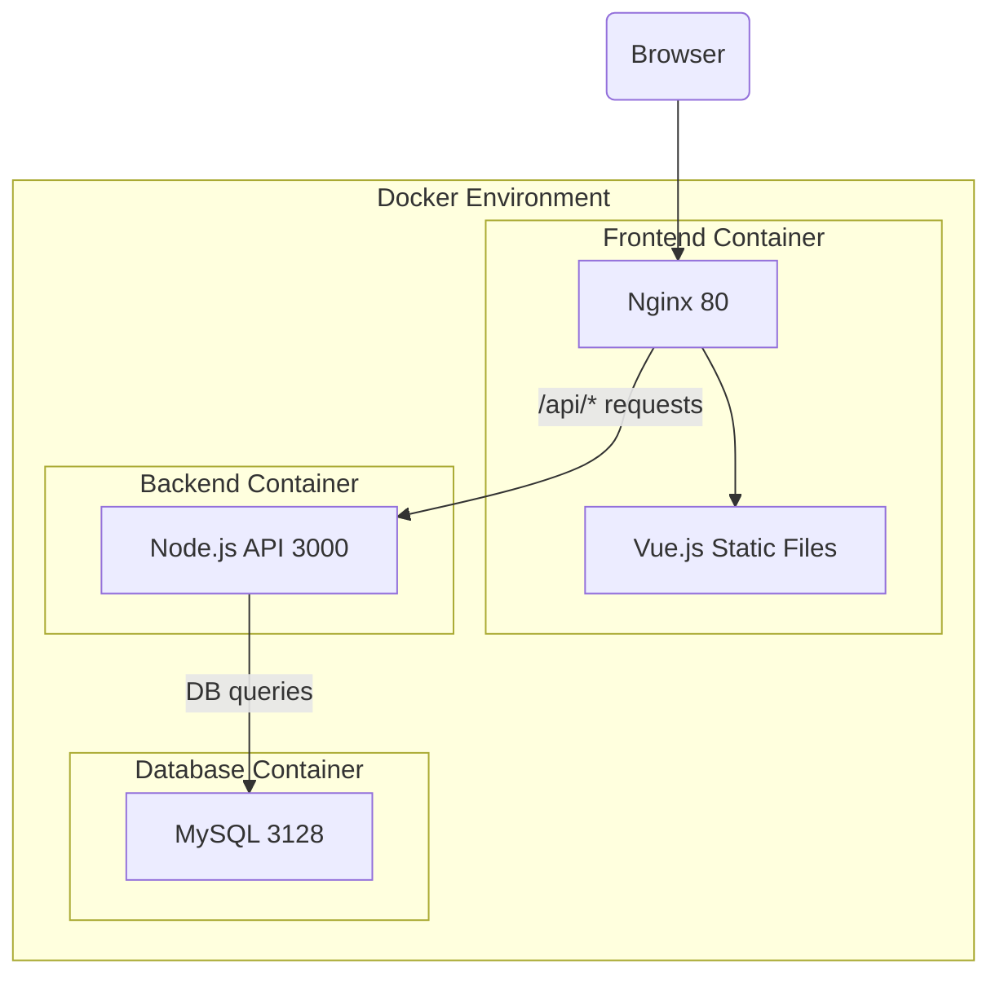

This repository contains the code for the todo app.

### Backend
Backend is built with NestJS and uses MySQL as the database.

### Frontend
Frontend is built with Vue.js.

Instruction for building and running can be found in README file in respective folders.

# Deployment
Deploy this application in a single EC2 machine, using `docker-compose`
* Backend is to be run as node process in a docker
* MySQL database required for backend is to be run under separate docker
* Frontend is to be first "built" for production and then to be served as static files through nginx in seperate docker
* DB configuration is to be provided to backend server through env variable

Here is the indicative deployment architecture diagram:

#### Optional Tasks
* Access Logs from Nginx, Error logs of MySQL and console log of backend to be streamed to CloudWatch
