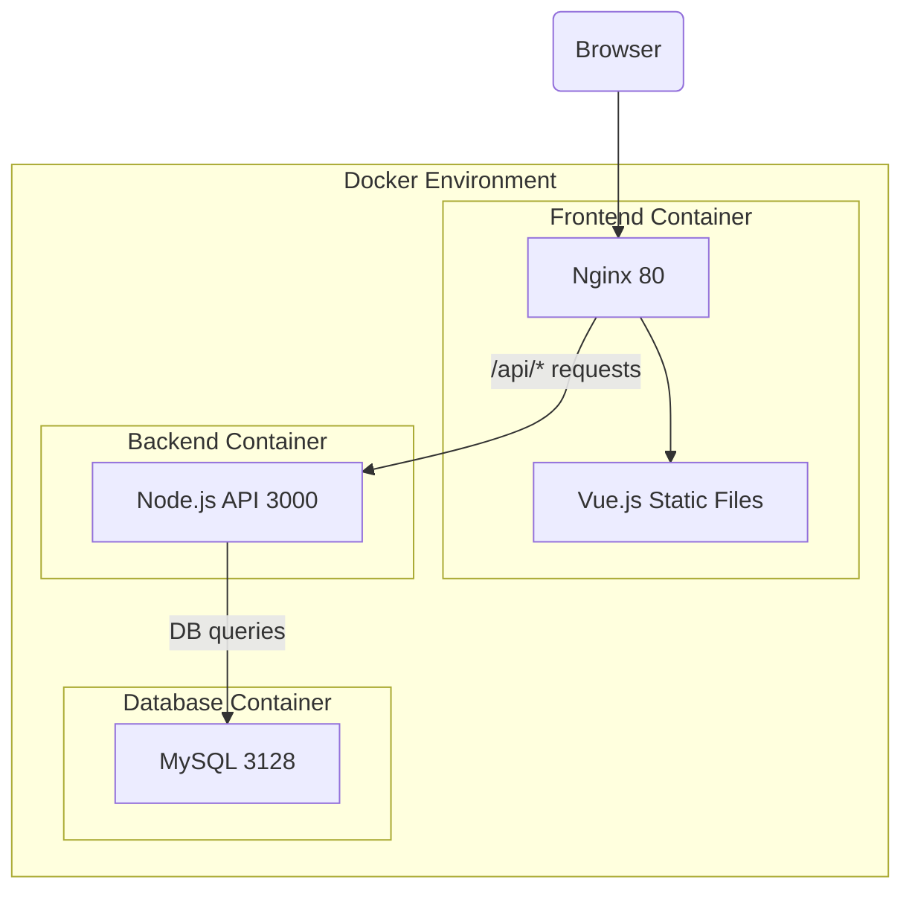

This is deployment guide for the todo app.

## Prerequisites

- Docker
- Docker Compose
- Node.js
- MySQL

This repository contains the code for the todo app.

## Backend

Backend is built with NestJS and uses MySQL as the database.

### Database

MySQL is used as the database.

## Frontend

Frontend is built with Vue.js

README.md in respective folders has details about the setup and deployment.
